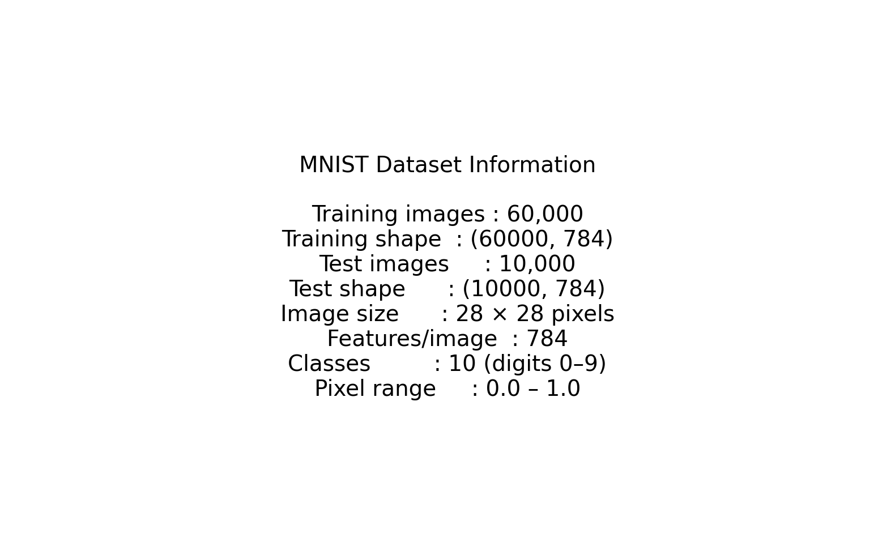
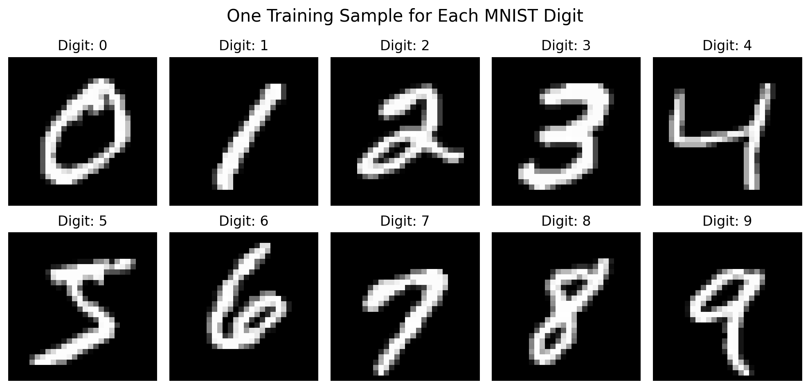
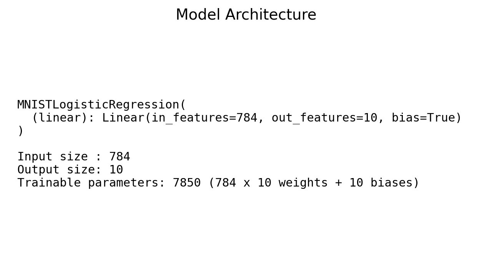
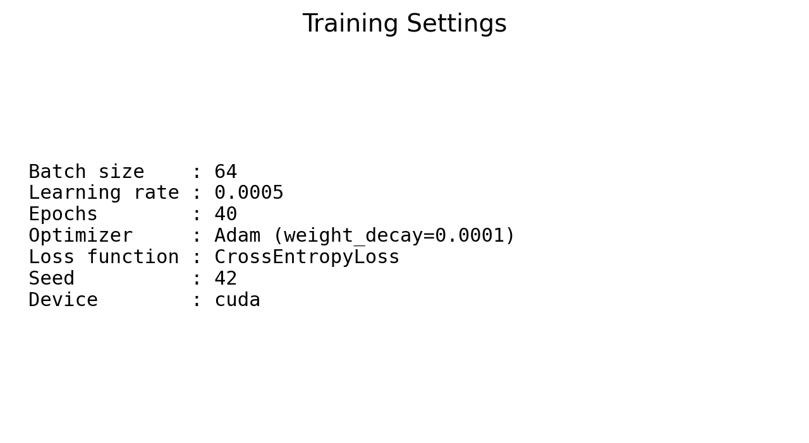
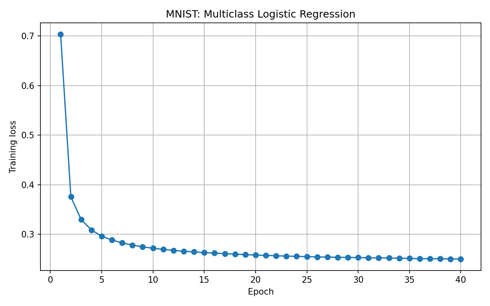
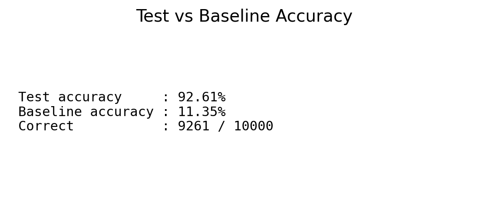
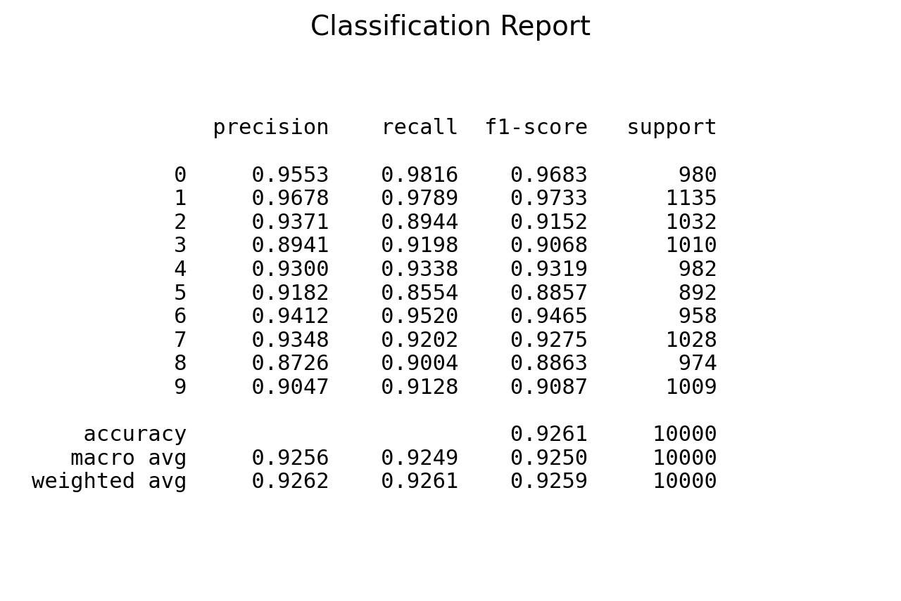
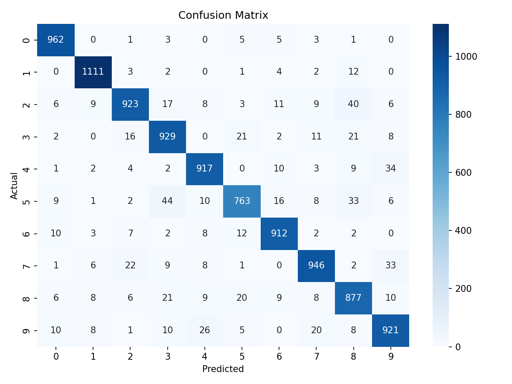
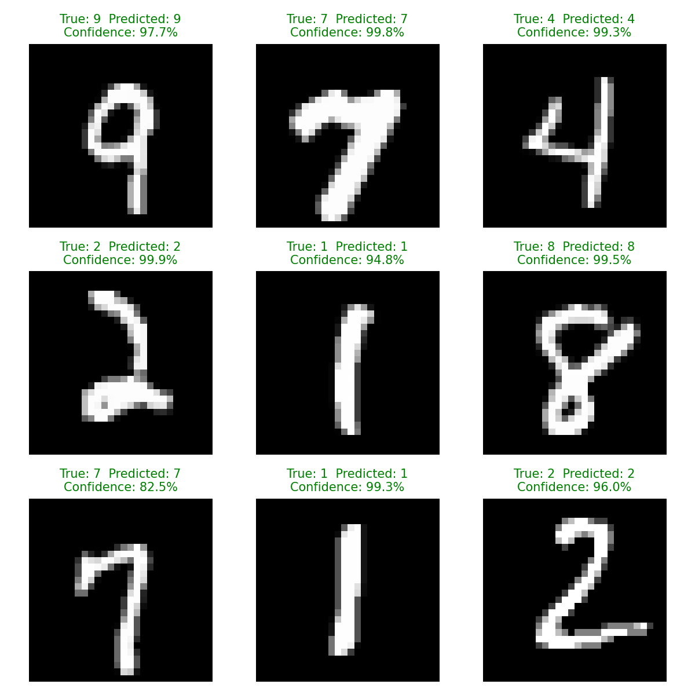
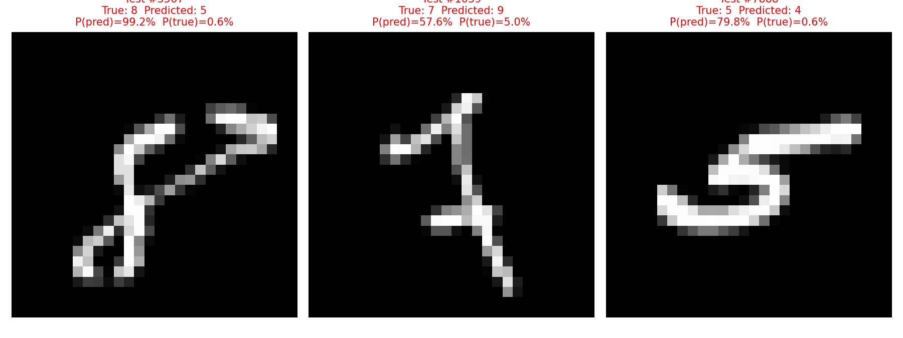

# Handwritten Digit Recognition
# Project Files
| File | Description |
|---|---|
| `data_prep.py` | Download, validate, and normalise the data; save dataset figures |
| `train.py` | Train, evaluate, visualise, and save the model |
| `predict.py` | Load the saved model and predict without retraining |
| `requirements.txt` | Required packages |
| `outputs/` | Saved model, evaluation results, and figures |

## 3. Installation and Running

```bash
python -m pip install -r requirements.txt
python data_prep.py
python train.py
python predict.py
```
## 4. Dataset and Preprocessing

**Dataset:** `kagglehub.dataset_download("oddrationale/mnist-in-csv")`

| Item | Value |
|---|---|
| Training images | 60,000 |
| Test images | 10,000 |
| Image size | 28 × 28 pixels, 1 grayscale channel |
| Input features | 784 |
| Classes | 10 (digits 0–9) |
| Columns per CSV | 785: one `label` + 784 pixels |
| Files | `mnist_train.csv`, `mnist_test.csv` |
<<<<<<< HEAD
=======

60,000 training images and 10,000 test images.

1. **Image dimensions and class labels:**  
   Each image is 28 × 28 pixels with 1 grayscale channel. The class labels are integers 0–9, representing the ten digit classes.

2. **Why convert each image into 784 values?**  
   28 × 28 = 784, so each image is converted into a flat vector of 784 pixel values. The linear layer expects a flat input vector, and the CSV dataset already stores the images in this format.

3. **Why divide pixel values by 255?**  
   Pixel values range from 0 to 255. Dividing by 255 scales them to the range 0–1, which provides a smaller and consistent input scale, helping produce more stable gradients and faster convergence.

4. **Why must training and test data remain separate?**  
   The training set is used to update the model weights, while the test set must remain unseen during training so it can measure how well the model generalises to unseen data. Mixing the two can causes data leakage (data contamination). It may cheats by memorizing the answers it is supposed to be tested on.

# Training and test shapes.



# Sample image for each digit.


## 5. Workflow

1. Download the MNIST CSV files using KaggleHub.
2. Separate the pixel values (`X`) from the labels (`y`).
3. Validate the data and scale pixel values to the range 0–1.
4. Convert the data to tensors and create mini-batches using `DataLoader`.
5. Train a single linear layer using cross-entropy loss and the Adam optimizer.
6. Evaluate the model on the test set and compare its accuracy with a most-frequent-class baseline.
7. Generate a loss plot, confusion matrix, and sample prediction visualisations.
8. Save the trained model and evaluation results to `outputs/`.


## 6. Model and Training

```python
class MNISTLogisticRegression(nn.Module):
    def __init__(self):
        super().__init__()
        self.linear = nn.Linear(784, 10)

    def forward(self, x):
        return self.linear(x)
```

| Tensor | Shape |
|---|---|
| Input pixels | `(64, 784)` |
| Output logits | `(64, 10)` |
| Labels | `(64,)` |

The model uses a single linear layer that maps 784 input pixel values to 10 output logits, one for each digit class (0–9). A batch size of 64 means 64 images are processed at once.

Training uses **cross-entropy loss** with the **Adam optimiser**.

### Model Architecture

The model uses **784 inputs** because each 28 × 28 grayscale image contains 784 pixel values. It uses **10 outputs** because MNIST has 10 digit classes (0–9). Each output is a score (logit) for one digit class.

The model has **7,850 trainable parameters**:

`784 × 10 + 10 = 7,850`

The predicted digit is the class with the highest output score.

### Why CrossEntropyLoss?

`CrossEntropyLoss` is used for multiclass classification. It compares the model's output logits with the correct digit label and penalises incorrect predictions.

It applies `log-softmax` internally, so the model outputs raw logits without needing a separate softmax layer. Labels are stored as integer class indices using `torch.long`.

### Training Settings

| Setting | Value |
|---|---|
| Batch size | 64 |
| Learning rate | 0.0005 |
| Epochs | 40 |
| Optimizer | Adam, `weight_decay=0.0001` |
| Loss | `CrossEntropyLoss` |
| Seed | 42 |

### Training Loss

The training loss decreased from **0.7037** in epoch 1 to **0.3756** in epoch 2 and **0.2500** in epoch 40, which is a **64.5% overall reduction**.

Most of the improvement occurred during the first few epochs, with the loss decreasing from **0.7037 to 0.2962** by epoch 5. After that, the curve gradually flattened. For example, the loss was **0.2719** at epoch 10 and **0.2530** at epoch 30.

This shows that the model learned quickly and then gradually converged. The small improvement during the later epochs suggests that additional training would provide limited benefit for this single linear layer. Training loss is not the same as error percentage, and the training-loss curve alone cannot determine whether the model is overfitting. The test results are used to evaluate performance on unseen data.





## 7. Evaluation and Predictions

Evaluation runs with `model.eval()` and `torch.no_grad()`. Softmax converts logits into probabilities, and `argmax` selects the digit with the highest probability. A high probability is an estimate, not a guarantee.

| Metric | Value |
|---|---|
| Test accuracy | **92.61%** |
| Correct / incorrect | 9,261 / 739 of 10,000 |
| Most-frequent-class baseline | **11.35%** (always predicts digit 1, which has 1,135 of the 10,000 test images) |

### Test Accuracy

The model achieved **92.61% accuracy**, correctly classifying **9,261 of 10,000** test images.

Compared with the most-frequent-class baseline, the model achieved **92.61% vs 11.35%**, a difference of **81.26 percentage points**. The baseline never looks at the image, so the gap shows that the model learned meaningful pixel patterns. However, this does not guarantee that the model is suitable for real-world images.

### Per-Class Recall

The highest recall was for digit **0 (98.16%)**, followed closely by digit **1 (97.89%)**.

The lowest recall was for digit **5 (85.54%)**. Digit 5 was often mistaken for digit 3 (**44 cases**) and digit 8 (**33 cases**). It also had the fewest test images, with **892 samples**.

### Frequently Confused Pairs

| Pair | Total errors | Direction |
|---|---:|---|
| 3 and 5 | 65 | 3→5: 21; 5→3: 44 |
| 4 and 9 | 60 | 4→9: 34; 9→4: 26 |
| 7 and 9 | 53 | 7→9: 33; 9→7: 20 |
| 5 and 8 | 53 | 5→8: 33; 8→5: 20 |
| 2 and 8 | 46 | 2→8: 40; 8→2: 6 |

Some pairs are strongly directional. For example, digit 5 is mistaken for 3 twice as often as 3 is mistaken for 5, while digit 2 is mistaken for 8 much more often than 8 is mistaken for 2.

### Causes of Incorrect Predictions

- A linear model learns one weight template per digit and has no spatial reasoning.
- Similar digit shapes overlap heavily in pixel space, particularly 4/9 and 3/5/8.
- Unusual handwriting, slant, and stroke thickness can cross the linear decision boundaries.
- Shifted or rotated digits change which pixel positions contain useful information.

### Does High Test Accuracy Guarantee Correct Camera Predictions?

No. MNIST digits are centred, size-normalised, clean, and presented as white-on-black images. Camera images can differ in lighting, background, contrast, colour, stroke width, rotation, scale, and position.

This distribution shift can significantly reduce performance when using a linear model on raw pixels. `predict.py` autocontrasts, auto-inverts, and resizes the image, but the original preprocessing did not crop or centre the digit.

The model also has no **"unknown" class**, so a non-digit input will still receive a digit prediction.

### Camera-Image Test

Handwritten digits were photographed on paper and tested using `predict.py`.

#### Round 1: Plain Resize

The original preprocessing simply resized the entire photo to 28 × 28 pixels. Two photos of the handwritten digit 6 were tested.

| Photo | Predicted | Confidence | P(true class 6) |
|---|---|---:|---:|
| `test-handwritten-num.jpg` (wide, tilted 6) | 3 | 94.91% | 0.00% |
| `test2.jpg` (upright, blurry 6) | 3 | 92.90% | 0.00% |

Both predictions were **wrong and confident**, even though the model achieved 92.61% accuracy on the MNIST test set.

The problem is that a resized camera photo looks very different from an MNIST image. The digit occupies only part of the frame, the wide photo is compressed into a square, paper shadows become grey pixel regions, and thin pen strokes become faint.

A linear model scores pixel overlap against learned digit templates, so it cannot recognise the same digit reliably when it is small, shifted, distorted, or positioned differently.

#### Round 2: Crop and Centre Preprocessing

The same model weights and the same photos were tested using two preprocessing modes. `--raw` performs a plain resize, while the default mode removes the paper background, keeps the main stroke, crops to the digit, pads it to a square, resizes it to 20 × 20, and centres it in a 28 × 28 image.

| Photo | Strokes | `--raw` | Default (crop and centre) |
|---|---|---|---|
| `test7-1.jpg` | Thick | 3 (91.41%), wrong | **7 (94.98%)**, correct |
| `test7.jpg` | Thin | 3 (86.24%), wrong | **7 (70.94%)**, correct |

### What the Camera Test Shows

1. **Preprocessing was the main problem.**  
   The model did not change. The same photo produced a confident 3 with a plain resize and a correct 7 after the digit was cropped and centred.

2. **Thicker strokes give higher confidence.**  
   With the default preprocessing, the thick 7 achieved 94.98% confidence compared with 70.94% for the thin 7. A thicker stroke activates more pixels that match the learned digit template, while thin strokes can lose information when resized.

3. **Confidence is not correctness.**  
   The wrong predictions were 86–95% confident. A high softmax probability only means that the input matches one learned class more strongly than the others.

4. **The shape still matters.**  
   Stroke thickness can affect the score, but the overall shape determines which digit receives the highest score. A thick but unclear digit can still produce a confident incorrect prediction.

Overall, high MNIST test accuracy does not guarantee correct predictions on camera images. Performance depends heavily on preparing the input so that it resembles the training data. The linear model also has limited ability to handle rotation, unusual handwriting, shifted digits, or non-digit inputs.

### Incorrect Prediction Examples

#### Test #3567: True 8, Predicted 5

**P(pred) = 99.2%, P(true) = 0.6%**

The 8 is slanted and its upper loop is partially open, with a long stroke extending toward the top right. This creates pixel patterns that resemble the shape of a 5.

The model was confidently wrong because a linear model evaluates pixel patterns using learned weights and cannot explicitly determine whether a loop is closed. Digits 5 and 8 are also a frequently confused pair, with 53 combined errors.

#### Test #1039: True 7, Predicted 9

**P(pred) = 57.6%, P(true) = 5.0%**

The 7 is thin and unusual, with an extra hook near the top left and a crossing stroke near the bottom. Some of these pixels overlap with areas associated with the shape of a 9.

The model was relatively uncertain compared with its 97–99% confidence on many correct predictions. Digits 7 and 9 are another frequently confused pair, with 53 combined errors.

#### Test #7888: True 5, Predicted 4

**P(pred) = 79.8%, P(true) = 0.6%**

The 5 is written sideways and heavily slanted, causing its main strokes to appear in unusual pixel positions. Raw-pixel logistic regression is not position- or rotation-invariant, so the learned template does not match it well.

The long horizontal stroke at the top also resembles the crossbar of a 4.

**Common thread:** these examples contain unusual, slanted, or ambiguous handwriting that differs from the average MNIST digit patterns learned by the linear model.

### Figures

- **Test vs baseline accuracy:** 
- **Classification report:** 
- **Confusion matrix:**   
  Rows represent actual classes and columns represent predicted classes.
- **Nine random test predictions:**
  Green indicates correct predictions and red indicates incorrect predictions.
- **Three incorrect predictions:** 

## 8. Saved Outputs

| File | Contents |
|---|---|
| `dataset_shapes.png`, `sample_digits.png` | Dataset figures |
| `model_architecture.png/.txt`, `training_settings.png/.txt` | Model architecture and training settings |
| `training_loss.png` | Training loss curve |
| `accuracy_baseline.png`, `classification_report.png` | Test accuracy vs baseline and per-class metrics |
| `confusion_matrix.png` | Actual vs predicted class counts |
| `predictions_9.png`, `incorrect_predictions.png` | Sample predictions and incorrect predictions |
| `evaluation.txt` | Accuracy, baseline, recall summary, confused pairs, and classification report |
| `mnist_logistic_model.pth`, `model_config.json` | Model weights (`state_dict`) and configuration |

The `state_dict` stores only the model parameters. `predict.py` recreates the same architecture and layer name (`linear`) before loading the saved weights.

`predict.py` does not import `train.py`, because importing `train.py` would execute its top-level training code and retrain the model.
